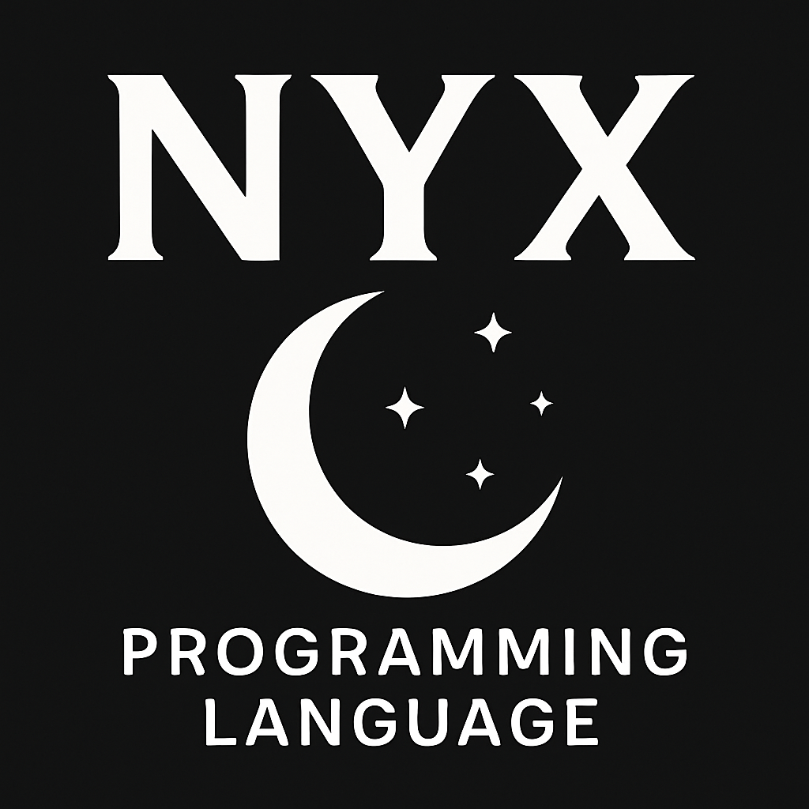

<p align="center">
    
</p>

# Nyx Programming Language


**Nyx** is a systems programming language inspired by C++,
designed for performance, flexibility, and expressiveness. It
combines low-level control with modern features, while keeping
the syntax approachable and concise.

---

## Features (Planned)

- C++-like syntax with modern simplifications
- Strong type system
- Memory safety without sacrificing performance
- `.nyx` source file extension
- Cross-platform support

---

## Example

A simple "Hello, World!" program in Nyx might look like this:

```nyx
$IMPORT io;

int main() {
    io::out("Hello, World!");
    return 0;
}
```

---

## Goals
- High performance, close to the metal
- Powerful abstractions without runtime overhead
- Familiar syntax for C/C++ developers
- Inspired by **Nyx**, the greek goddess of the night -
mysterious, fundamental, and powerful

## Project Status

Nyx is in **early development**. Expect frequent changes and
experimentation.\
Contributions, ideas, and discussions are welcome!

## Roadmap

- Core compiler setup
- Parser and AST generation
- Type checker
- Code generation (target: LLVM backend)
- Standard library (`io`, math, collections)
- CLI tooling (`nyx make`)
- Package manager (future)

---

## Why Nyx?

C++ is a powerful but often complex and error-prone.\
Nyx aims to provide:
- A simpler, more consistent syntax
- Safer defaults (memory safety, bounds checks in debug mode)
- Modern Tooling (package manager, build system, etc.)

Unlike many new languages that rely on LLVM or C transpilation,
Nyx is designed with its own custom compiler.  
This gives us full control over:
- Lexing, parsing, and code generation
- Our own intermediate representation (IR)
- Direct machine code output in the future

---

## Nyx Project Structure

When you create a new Nyx project, the folder structure looks
like this:

my_project/\
├── src/\
│ └── main.nyx # Main source file\
├── include/ # Optional header/library files\
├── build/ # Compiled output (created after building)\
├── nyx.json # Project metadata / configuration\
└── README.md # Project README

---

## Contributing

Nyx is an open source project, and contributions are welcome!\
Here are some ways you can help:
- Report bugs and suggest features
- Contribute code (parser, compiler, CLI, libraries)
- Write documentation, examples, or tutorials

Before opening a pull request, please check the current roadmap
and open issues.

---

## Community

Join the discussion on [Discord](https://discord.gg/ahnMQuUv3n)

---

## Building from Source (WIP)

Right now, building Nyx requires a C++20-compatible compiler (GCC,
Clang, or MSVC) and CMake.

```shell
git clone https://github.com/mimic_vr5/nyx.git
cd nyx
mkdir build && cd build
cmake ..
make
```

This will build the Nyx CLI (`nyx`) which will later be used for
project creation and compiling `.nyx` files.

*(Note: Windows users can use MSYS2/MinGW or Visual Studio
with CMake.)*

---

## License

MIT License - feel free to use, modify, and share.